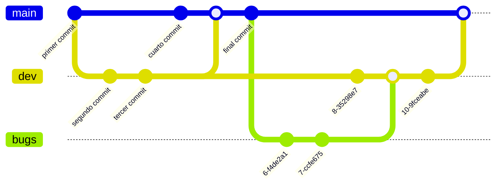

```mermaid
  gitGraph
  commit id: "primer commit"
  branch dev
  commit id: "segundo commit"
  commit  id: "tercer commit"
  checkout main
  commit  id: "cuarto commit"
  merge dev
  commit id: "final commit"
  branch bugs
  commit
  commit
  checkout dev
  commit
  merge bugs
  commit
  checkout main
  merge dev
```
