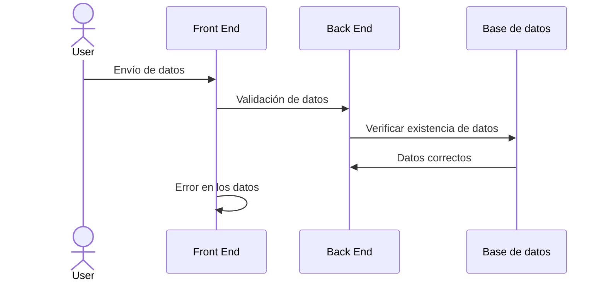

```mermaid
sequenceDiagram

actor U as User

participant F as Front End
participant B as Back End
participant DB as Base de datos

U ->> F : Envío de datos
F ->> B : Validación de datos
B ->> DB: Verificar existencia de datos
DB ->> B : Datos correctos
F ->> F : Error en los datos
```
